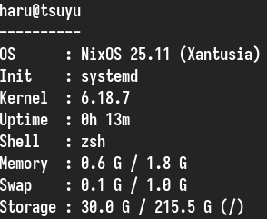

# rfetch
This is my own fetch, witten in rust and I made this project by vibe coding.

Hello, my name is neko-chi. I want to post my fetch project ( ˶°ㅁ°) !! I code this fetch with vibe code, because I want to make a project and I dont know how to code (ᗒᗣᗕ)՞ Why i named it rfetch? Because I write in rust (˶˃ ᵕ ˂˶)

If you want to help this project more better, you can do that, you really help this project more better (づ> v <)づ♡

By the way I didnt make it as binary, maybe I'll make it as binary later. I really sorry for that (ᵕ—ᴗ—)

# Depedencies need for this project 
    You must have this depedencies:
    - Rust
    - Cargo

    Fedora:
    $ sudo dnf install rustc cargo

    Debian:
    $ sudo apt install rustc cargo
    
    Arch:
    $ sudo pacman -S rust cargo
    
    NixOS:
    {
      environment.systemPackages = with pkgs; [
        rustc
        cargo
      ];
    }
    
    and then: $ sudo nixos-rebuild switch

    For other distros, you can search rust and cargo package in your web package distros based 
    by package manager or you can ask ChatGPT ◅(´⌯⩊⌯`)▻

# How to use this project
    After you installed depedencies need for this project.
    You can use it by this command:

    cd to directory by: $ cd Downloads/rfetch/rfetch/src
    after that use this command: $ cargo run

# Screenshot

